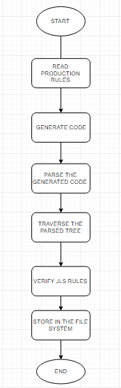

## _Objective_
To develop a randomly generated program that adheres to the Java Language Specification and Java grammar rules. The randomly generated code can be compiled, however the generate code is a meaning less program that has no logic to itself. The Application was built using the Java programming language that supports Java 1.8 JDK. IntelliJ has been promising over the years with cool features that improves dev time, so IntelliJ was the ideal IDE for us to start working on the project. 

The three main functions of the application are the following:

•	Implementing the production rules (Java Grammar) and generate code.

•	Parse the generated code, and later traverse the parse tree and match against JLS rules.

•	The semantically correct code is then stored as a .java file.



The above flowchart gives a high-level view of the implementation. The program starts by reading the production rules from the grammar file given to it as the input, it generates a code randomly based on the given grammar while making sure the generated code adhere to the constrains provided. The Generated code is then passed to Parser where a parse tree is created for the generated grammar.The idea here is to verify the JSL rules by traversing the parse tree. Multiple checks and balance measures are taken here to make sure the generated code is compilable. Once it is done the code is then saved to the file system as a .java file.

## _Implementing production rules (java grammar) and generate code_
The grammar is read from java_grammar.txt file and subsequent maps are created for the terminal and non-terminal nodes. The program recurses through the grammar map by growing the non-terminal nodes, and terminates until a terminal node is reached for each of the recursion. The generated code is appended in a string form. 

## _Parsing the generated code and matching java language rules_
The generated code is then parsed to create a parse tree using JAVA parser. Appropriate java syntax rules are matched as and when tree is traversed through each node. Whenever a node in the parse tree does not match the corresponding JLS rule, we either regenerate the code for the node or delete the node. The output of the parse tree is then written into .java class file. 

The following code snippet is an instance of a randomly generated program, you will notice that the code is syntactically and semantically correct that is being handled in the application. Henceforth, the objective of this application.

````
 package oole.random.gwvsuq;

import oole.random.*;

public class TenKLOCrkmpjw {

    protected TenKLOCrkmpjw(byte kyhifw) {
        if (jdmejt != lplgdq) {
            if (sljgpt == sezqal) {
                boolean rhffrq, ceudhy;
                float bnyacc;
                while (jxbyvm == yschqe) {
                }
            } else {
            }
            if (vllmpe != zefsap) {
            }
        }
        int qgkivi;
    }

    TenKLOCrkmpjw(boolean udkcco, float pmyjoy, boolean hjqofj, double mgqldn) {
    }

    public boolean kzqafg, iubkny;

    public TenKLOCrkmpjw() {
    }

    public int jdmejt;

    public int lplgdq;

    public int sljgpt;

    public int sezqal;

    public int jxbyvm;

    public int yschqe;

    public int vllmpe;

    public int zefsap;
}

````

Some of the JLS rules handled in the project:

**Method Local Variable:**

Variable can't have more than once access modifier in their signature

Variable can't be used before initialization

**Enum Declaration:**

Enum cannot have public or protected constructors

**Import Declaration:**

Imports are a part of the java package or one of the classes in the project

**Nested class:**

Nested class must be static.

**Inner Class:**

Inner classes cannot be static.

**Method:**

Method Declaration as an abstract method can't have another of the keywords like Native, Sync, Final, Private.

Static methods cannot access non-static fields. 

Instance method cannot override a static method.

Method cannot override a final method.

Static method cannot hide an instance method.

**Field:**

Checks the method signature to make sure that the variable declaration does not have more than one access modifier.

**Abstract Class:**

Check if all the methods in an abstract class are declared as abstract.

Abstract class cannot be declared as final.

Methods inside an abstract class cannot be final.

**Package:**

Package name must follow JLS rules for package definition.

**Return Statement:**

Return statement must match the return type of the method.

Return statement must return a variable in the scope.

Return statement must return a value that matches the return type of the method.

**Super Class:**

Only abstract and concrete classes can be extended.

Only interfaces can be implemented.

Import declaration must be added for super types.

A class can only extend one concrete/abstract class.

A class can implement multiple interfaces.

**Class:**

_Class definition_ cannot contain both final and abstract.

private class cannot be inherited.

There can be only one public class in a java file.

final classes cannot be inherited from.

**Interface:**

_Interface definition_ cannot contain both final and abstract.

Interface methods cannot have method bodies. 

All interface methods must be overridden by the concrete subclass

**Concrete Subclass (Method Overriding):**

_Concrete subclass_ of a interface or abstract class must override all the abstract methods.

The overridden method must have the same signature as the superclass method.

The overridden method must have the same return type as the superclass method.


**Constructor:**

Constructor name should match the class name exactly.

If a class has a parameterized constructor, it must have default constructor.

No two constructors can have the same parameter list.

**Conditional Statements:**

The conditional part of the if/while loop must always return boolean

In switch statement, the case label must match the switch variable type.

**Exception Handling:**

A try must be followed by catch/finally block.

A catch must be preceded by the try block.

## _Configuration parameters_

The configuration parameters as mentioned in the project description are read from the xml file, and the same constraints are realized during the code generation. 

**XmlFileReader.java** class is used to read the constraints specified in the configuration file.

The readXmlFile method that's implemented in the XmlFileReader class reads all the attributes from the xml file that has all the upper and lower bounds to successfully generate a program.
As the readXmlFile method is invoked in the constructor, all the getter methods are available to get values. As you can notice the applicationConstraints class resembles a builder pattern. 

## _How to run the application?_
•	Please resolve all your dependencies before running the application

•	The randomly generated program in saved in the **_GeneratedClasses_** folder that resides in the **_D:/_** drive in your file system

•	We need to give the path in the config.properties where the generated code will be saved.


## _How to build the application?_
`gradle build`

## _Running the unit tests_
33 Test classes for all the possible scenarios were implemented.

**_Reflection_** was used in accessing modifiers that were private

**_Mockito_** was implemented to mock classes

**_PowerMockito_** was used in mocking static members of the class

**_JUnit_** was used for running assertions between the actual and expected values

## _How to run the test suit?_
`gradle test` 
(if this does not work for you, right click on "test" package and "Run Test")

## _Dependencies_
`testCompile group: 'junit', name: 'junit', version: '4.12'`

`testCompile group: 'org.mockito', name: 'mockito-all', version: '1.10.19'`

`testCompile group: 'org.powermock', name: 'powermock-api-mockito', version: '1.7.3'`

`testCompile group: 'org.powermock', name: 'powermock-module-junit4', version: '1.7.3'`

`compile group: 'sax', name: 'sax', version: '2.0.1'`

`compile group: 'org.apache.logging.log4j', name: 'log4j-core', version: '2.9.1'`
    
`compile group: 'org.apache.commons', name: 'commons-lang3', version: '3.0'`
    
`compile 'com.github.javaparser:javaparser-core:3.5.4'`

`compile group: 'commons-io', name: 'commons-io', version: '2.5'`


